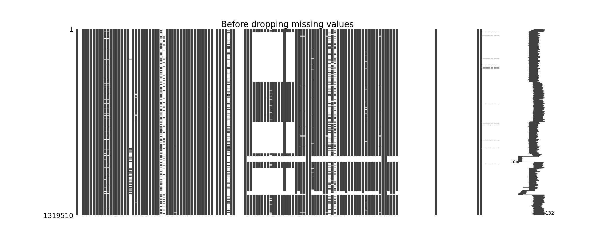
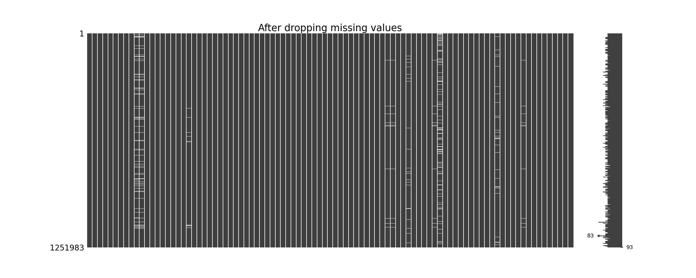
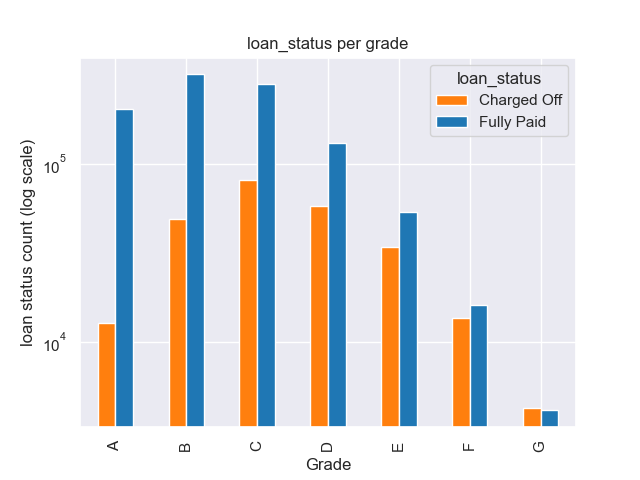
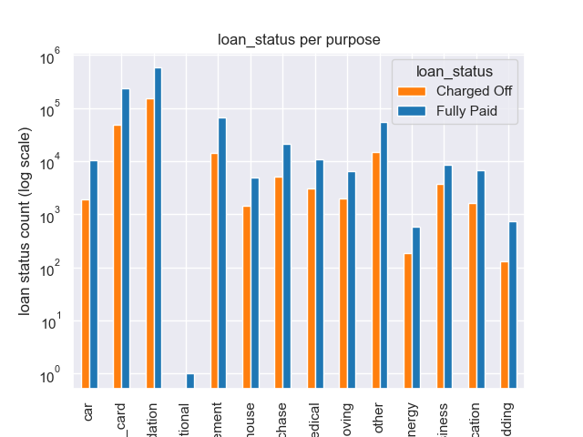
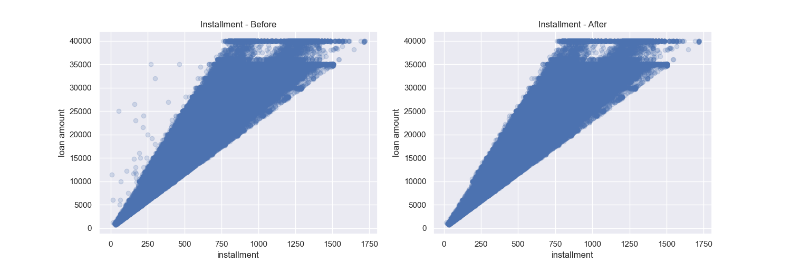
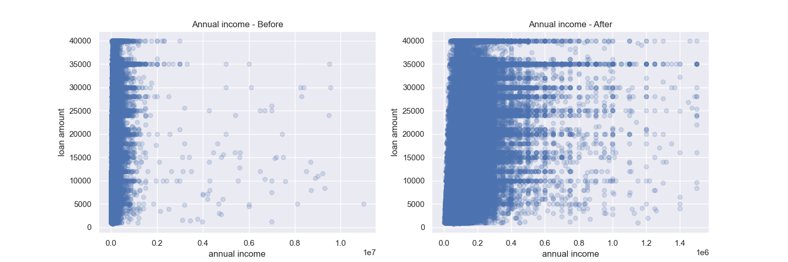
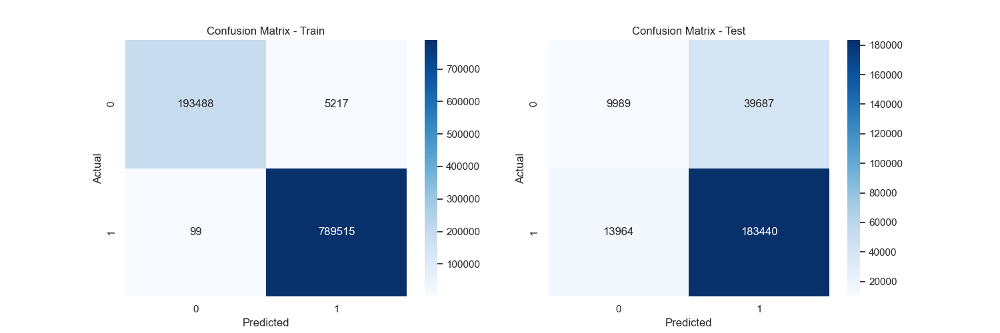
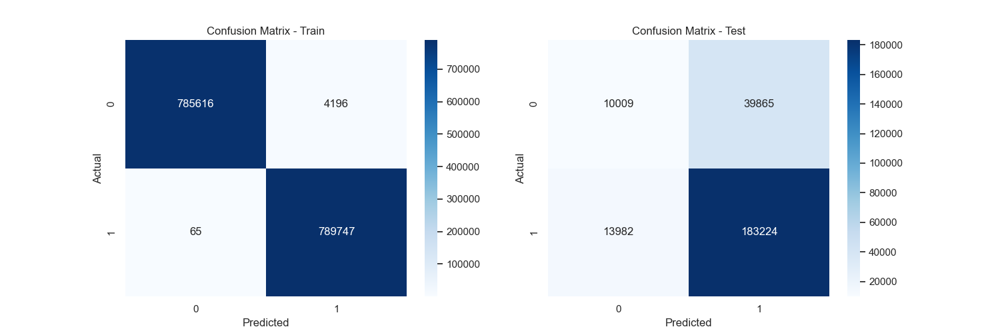

# Lending Club - Loan Defaulter prediction

## Overview

<p>Lending club offers personal loans to individuals based on the provided personal information. However, this does not stop some people from completely repaying their loan (Defaulters). This project is to build a model that can classify people who can repay their loan and defaulters. The idea is that this model developed using Supervised Machine Learning techniques, in the future, will be able to identify loan defaulters during the application processing.</p>

## About Dataset

[The Lending club loan data](https://www.kaggle.com/datasets/wordsforthewise/lending-club) is taken from Kaggle and it has all the loan application information from 2007 to 2018. Kaggle has the list of both accepted and rejected applications. For this project, we will be only working with the accepted loan applications as we are trying to predict  defaulters.

<p>The data has over 2 million records and 151 columns. There is a data dictionary provided in the docs folder of this repo for this data. Most of these columns will be filtered out in the preprocessing steps.</p>

## IDE and Environment

- Programming Language : Python
- IDE : Jupyter Notebooks
- Environment : environment.yml file included

## Data Cleaning and Data preprocessing

<p>Firstly, I filtered the data to have only 2 categories of loan status i.e., `Fully Paid` and `Charged off` (defaulters). Secondly, There are two types of applicants, individual applicants and joint applicants. There are some additional columns specially for joint applicants which are null values for individual applicants. So, filter the data to get only the records of individual applicants.</p>

<p>The following is the distribution of loan_status (target) categories.</p>

```
Fully Paid     1057295
Charged Off     262215
Name: loan_status, dtype: int64
```

<p>There are a lot of missing values in the data. The following is the missing value representation of the data using missingno library. The list of columns having more that 30% missing values in them is listed in the `preprocessing.ipynb` notebook. 58 columns are identified from the above process which are dropped. Even after this, there are records where there are more that 20 missing column values.</p>



<p>After removing the above missing values (based on defined thresholds), the following is the resulting missingno plot representation.</p>



<p>Later, columns that are not significant or directly indicate the output are dropped and the resulting data is saved into a new file.</p>

## Visualizations

<p>On this data, I have plotted a few visuals to see how loan status is distributed with respect to certain features. All these plots are present in the `pre_EDA.ipynb`. Two of these plots are given below:</p>

- Loan Status per grade:



- Loan Status per purpose:



<p> For percentages, additional plots and information check out the `pre_EDA.ipynb` notebook </p>


## Encoding

<p>After dropping a few other column, I have encoded categorical columns using techniques like manual encoding, TargetEncoder and LabelBinarizer. The following is a list of categorical columns and their respective class count.</p>

```
- grade, 7
- sub_grade, 35
- home_ownership, 6
- verification_status, 3
- purpose, 14
- initial_list_status, 2
- loan_status, 2
```

<p>The following are few of the mappings for the encoding used on the above columns</p>

```
Mapping used for grade:
 {'A': 0, 'B': 10, 'C': 20, 'D': 30, 'E': 40, 'F': 50, 'G': 60}

Sub grade is calculated based on grade encoding.

Mapping used for home ownership:
 {'NONE': 0, 'OTHER': 1, 'ANY': 2, 'MORTGAGE': 3, 'RENT': 4, 'OWN': 5}

Mapping used for verification_status:
 {'Not Verified': 0, 'Verified': 1, 'Source Verified': 2}
 
Mapping used for initial_list_status:
{'f': 0, 'w': 1}

Mapping used for loan_status (target):
 {'Charged Off': 0, 'Fully Paid': 1}
```

## Outliers

<p>I have removed outliers both manually and using Scikit-learn library methods. Using manual approach, I used scatter plot to understand what might be potential outliers and filter them. These are present in `encoding_imputing.ipynb` notebook. The following are two examples among many:</p>

- For installment:

 

- For Annual Income:

 

<p>Later, I used IsolationForest and LocalOutlierFactor from scikit-learn to identify outliers. I removed only those records which were identified as outliers by both these algorithms.</p>


## Imputing Missing values.

<p>I had to consider imputing the categorical and numerical features separately. However, there were no missing values for my resulting categorical data. Therefore I used `KNNImputer` to impute missing values for numerical columns. I saved this data to a new file called `imputed_data.csv`</p>


## Modelling

<p>Since the data is highly imbalanced, I tried 3 different approaches to build a model. I considered 4 different classifier algorithms i.e., Logistic Regression, DecisionTreeClassifier, Naive Bayes Classifier and XGBClassifier. </p>

#### Imbalanced data

<p>Firstly I used the original imbalanced data directly to see how the models performed without hyperparameter tuning. I felt that the better performing model was XGBClassifier. The following is its respective train and test confusion matrices</p>




#### Random Undersampling

<p>Undersampling is not good practice but, I wanted to see how the models were performing in this scenario. The scores dropped significantly and this is not a good approach to proceed with.</p>


#### Oversampling - SMOTE

Using SMOTE to generate synthetic minority data, the classification scores did not change (not affected). I generated synthetic minority data only on train data and tested it on the test data. XGBoost was again the best performing algorithm. The following is the confusion matrix for train and test data.




## Conclusion

Since the data is not balanced, looking at f1-score for model performance seemed appropriate. The XGBoost algorithm performed with 87% f1 score when used with imbalanced data and generated synthetic data. The data imbalance has made it difficult to improve the classification score for this project. However, this model might help in identifying defaults to an extent. I will revisit this project to implement more advanced Machine learning techniques to better identify the Loan defaulters. I would like to change the preprocessing steps (like grouping the numerical columns into small categories) and also implement Neural networks to see whether I can improve the classification scores.


